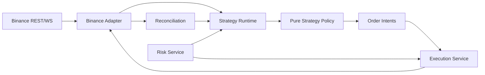
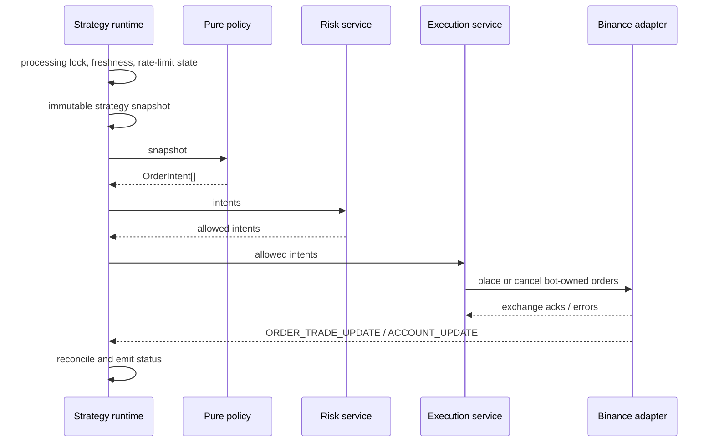
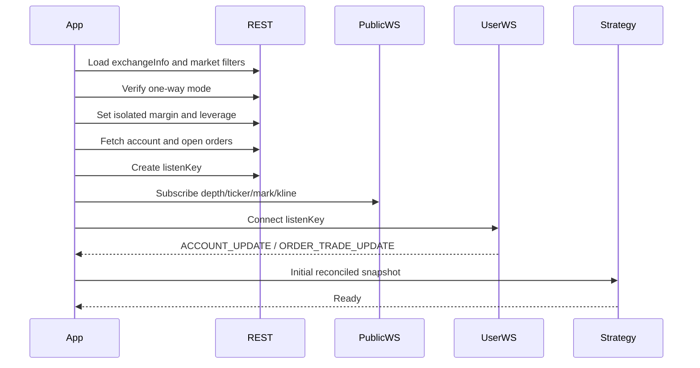
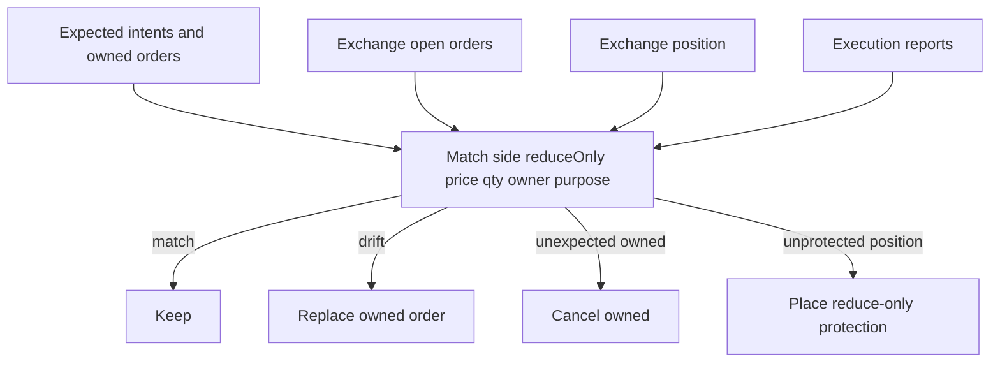
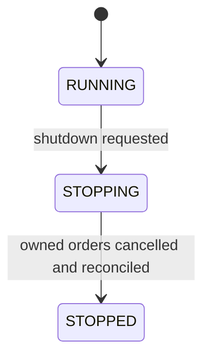

# Architecture

Authoritative for: layer boundaries, dependency direction, process flows, order ownership, and suggested directories.

Types: [domain-model.md](domain-model.md). Exchange mapping: [binance-usdtm.md](binance-usdtm.md). Risk: [risk-policy.md](risk-policy.md).

## Layer boundaries

| Layer | Responsibility | Must not |
|---|---|---|
| Domain | Canonical market, account, order, intent, and strategy types | Import CCXT or Binance DTOs |
| Strategy policy | Pure function: snapshot → `OrderIntent[]` | Import or call an exchange client |
| Application | Strategy runtime, risk, execution, reconciliation, shutdown | Embed Binance payload shapes |
| Infrastructure / Binance adapter | REST, public WS, user WS, precision, mapping | Leak CCXT objects to strategy |
| Risk | Limits, slippage, stale feeds, 429, kill switch | Be skipped because the venue is degraded |
| Config / CLI | Env schema, flags, instance identity | Treat `.env` as precision source of truth after `exchangeInfo` loads |

## Dependency direction



Rules:

- Strategy policy does not import a Binance client.
- Domain types do not reference CCXT types.
- Strategy returns `OrderIntent[]` instead of placing orders.
- Execution service is the **only** module that creates or cancels orders.
- Infrastructure converts Binance data into the canonical domain model.

## Strategy → Intent → Risk → Execution → Binance



Maker family policies return desired quotes; an order planner turns the diff into intents. See [strategies/maker-family.md](strategies/maker-family.md).

## Startup lifecycle

Runtime states:

```text
CREATED → STARTING → RECONCILING → READY → RUNNING
                                         ↘ DEGRADED → PAUSED
                                         ↘ STOPPING → STOPPED
```

Any running state may enter `DEGRADED`, `PAUSED`, or stop via kill switch. Rate-limit transitions: [risk-policy.md](risk-policy.md#rate-limit-states).



A strategy must not enter `READY` until all of the following are true:

1. Exchange metadata is loaded
2. Account snapshot is loaded
3. Open-order snapshot is loaded
4. User stream is connected **or** REST backup is running
5. Market feeds the strategy needs are live
6. Clock skew check passed (**TBD:** maximum allowed skew)

Exchange-level bootstrap: [binance-usdtm.md](binance-usdtm.md#startup-bootstrap).

## Runtime lifecycle

Every strategy uses the same tick shell:

1. Reject overlapping ticks with a processing lock
2. Check feed freshness
3. Check rate-limit state
4. Build an immutable strategy snapshot
5. Call pure policy
6. Pass intents through the risk service
7. Execution service performs order operations
8. Reconcile from order/account streams
9. Emit strategy status

Maker family adds desired-quote planning on top of this shell.

## Reconciliation flow

Reconciliation compares:

- Expected intents
- Bot-owned open orders
- Exchange position
- Last execution reports

Do not match orders by price alone. Match on **side**, **reduce-only**, **price**, **quantity**, **strategy owner**, and **purpose**.

On restart:

- Cancel only orders this **instance** owns
- Guardian must not cancel another strategy's stops
- Do not process entry signals until reconciliation finishes
- If a position exists, enter protection immediately (Guardian/Trend/Swing)

Maker quantity drift beyond tolerance triggers replace. Tolerance value: **TBD**.



## Shutdown flow

Graceful shutdown (testnet acceptance: cancel **owned** orders only):



Specified flags:

- `--cancel-only` — cancel bot-owned orders; do not flatten
- `--flatten-on-exit` — flatten using the kill-switch flatten path
- Kill switch modes `CANCEL_ONLY` and `CANCEL_AND_FLATTEN`: [risk-policy.md](risk-policy.md#kill-switch)

**TBD:** default shutdown if neither `--flatten-on-exit` nor a kill switch is used. Spec requires cancelling owned orders; it does not say whether an open position is left standing.

Do not call symbol-wide `cancelAllOrders`.

## Order ownership

Never use `cancelAllOrders(symbol)` without an ownership filter. That can cancel manual orders or another strategy's orders.

### clientOrderId

Format:

```text
<app>-<strategy>-<instance>-<purpose>-<sequence>
```

Examples from the spec:

```text
bfu-trend-a1-stop-000042
bfu-maker-a1-bid-000087
bfu-liquidity-a1-exit-000091
```

Rules:

- Every bot order has a verifiable prefix
- Startup reconciliation cancels only orders this instance owns
- Guardian does not cancel another strategy's stops
- v1 does not run multiple strategies on the same account/symbol
- A future multi-strategy run needs a portfolio coordinator (out of v1)

Binance `newClientOrderId` must match `^[\.A-Z\:/a-z0-9_-]{1,36}$`.

**TBD:** app prefix (`bfu` is only an example from the origin naming), how `INSTANCE_ID` maps into the instance segment, and truncation when the id would exceed 36 characters.

## Suggested directory structure

```text
src/
├── domain/
│   ├── market.ts
│   ├── account.ts
│   ├── order.ts
│   ├── intent.ts
│   └── strategy.ts
├── application/
│   ├── strategy-runtime.ts
│   ├── execution-service.ts
│   ├── reconciliation-service.ts
│   ├── risk-service.ts
│   └── shutdown-service.ts
├── infrastructure/
│   └── binance-usdm/
│       ├── rest-client.ts
│       ├── public-stream.ts
│       ├── user-stream.ts
│       ├── mapper.ts
│       ├── precision.ts
│       └── binance-adapter.ts
├── strategies/
│   ├── guardian/
│   │   ├── policy.ts
│   │   ├── state.ts
│   │   └── config.ts
│   ├── trend/
│   ├── swing/
│   └── maker/
│       ├── engine.ts
│       ├── classic-policy.ts
│       ├── offset-policy.ts
│       └── liquidity-policy.ts
├── indicators/
│   ├── sma.ts
│   ├── bollinger.ts
│   └── rsi.ts
├── risk/
│   ├── slippage.ts
│   ├── stop-loss.ts
│   ├── rate-limit.ts
│   └── kill-switch.ts
├── config/
│   ├── env.ts
│   └── schema.ts
├── cli/
│   └── index.ts
└── index.ts

tests/
├── unit/
├── contract/
├── integration/
├── fixtures/
└── testnet/
```

Do not create this tree until [implementation-roadmap.md](implementation-roadmap.md) Phase 1–2. Interfaces in [domain-model.md](domain-model.md) are design examples only.
