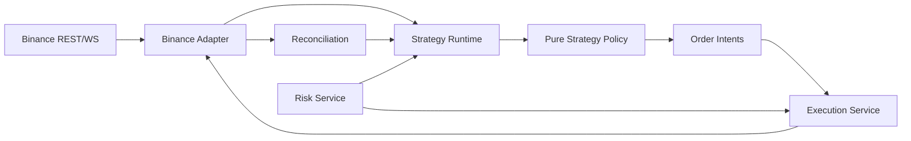
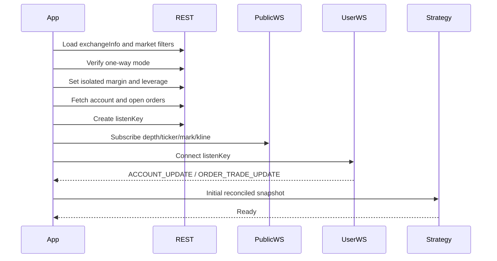

# Binance USDT-M Strategy Bot — Reimplementation Specification

เอกสารนี้เป็นข้อกำหนดสำหรับสร้าง repository ใหม่ที่รองรับเฉพาะ Binance USDⓈ-M Futures
โดยศึกษาพฤติกรรมจาก `ritmex-bot` แล้วออกแบบใหม่ให้แยก strategy logic ออกจาก exchange และ
execution layer อย่างชัดเจน

> สถานะ: Design specification  
> ตลาดเป้าหมาย: Binance USDT-M Futures  
> Runtime ที่แนะนำ: Bun + TypeScript  
> Position mode รุ่นแรก: One-way Mode (`positionSide=BOTH`)  
> Margin mode เริ่มต้น: Isolated  
> กลยุทธ์ที่รวม: Guardian, Trend, Swing, Maker, Offset Maker, Liquidity Maker

---

## 1. ขอบเขต

### 1.1 สิ่งที่ต้องรองรับ

1. Binance USDT-M Futures เท่านั้น
2. REST API สำหรับ:
   - โหลดข้อมูลตลาดและ precision
   - อ่านบัญชีและ position
   - อ่าน open orders
   - สร้างและยกเลิกคำสั่ง
   - ยกเลิกคำสั่งทั้งหมดที่ bot เป็นเจ้าของ
   - ตั้ง margin mode และ leverage
3. WebSocket สำหรับ:
   - Order book depth
   - Ticker
   - Mark price
   - Kline
   - Account updates
   - Order/trade updates
4. Strategy จำนวน 6 ตัว:
   - Guardian
   - Trend
   - Swing
   - Maker
   - Offset Maker
   - Liquidity Maker
5. Dry-run และ Binance testnet ก่อนเปิดใช้เงินจริง
6. Risk controls, reconnect, reconciliation และ graceful shutdown

### 1.2 สิ่งที่ไม่รวม

- Grid strategy
- Maker Points
- Basis arbitrage
- Binance Spot
- Multi-exchange router
- Lighter native signer
- Python bridge
- StandX/Nado/GRVT/Aster/Backpack/Paradex/OndoPerps
- Referral, copyright guard และ encrypted banner
- UI ขนาดใหญ่ในรุ่นแรก
- Hedge Mode หรือ simultaneous LONG/SHORT position

### 1.3 เหตุผลที่ไม่รวมแต่ละ strategy

| Strategy | เหตุผล |
|---|---|
| Grid | ผู้ใช้งานไม่ได้ต้องการ และมี state/recovery model เฉพาะทาง |
| Maker Points | ผูกกับ StandX โดยตรง |
| Basis Arbitrage | ต้องมีอย่างน้อย Spot/Futures สองขา หรือสอง venue |

---

## 2. ข้อควรระวังด้านสิทธิ์การใช้งาน

Repository ต้นทางไม่มี `LICENSE` ที่ root และไม่มีฟิลด์ `license` ใน `package.json`
จึงไม่ควรคัดลอก source code ไปเผยแพร่โดยตรงจนกว่าจะได้รับสิทธิ์จากเจ้าของ

แนวทางที่แนะนำ:

1. ใช้ repository ต้นทางเป็น behavioral reference
2. เขียน specification และ tests จากพฤติกรรมที่สังเกตได้
3. เขียน implementation ใหม่ใน repository ใหม่
4. ใช้เอกสารทางการของ Binance และ CCXT เป็น primary source
5. เพิ่ม `LICENSE` ที่เหมาะสมให้ repository ใหม่ตั้งแต่เริ่มต้น

เอกสารนี้ไม่ใช่คำแนะนำทางกฎหมาย

---

## 3. กลยุทธ์ทั้งหมดในผลิตภัณฑ์ใหม่

| Strategy | เปิด position | ปิด position | Protective orders | ลักษณะหลัก |
|---|---:|---:|---:|---|
| Guardian | ไม่เปิด | ไม่ market-close ตาม signal | Stop + Trailing | ดูแล position ที่มีอยู่ |
| Trend | เปิด | ปิด | Stop + Trailing + Profit Lock | SMA cross + Bollinger filter |
| Swing | เปิด | ปิด | Stop | RSI arm/cross |
| Maker | เปิดผ่าน limit | ปิดผ่าน reduce-only limit/market | Loss kill-switch | Quote สองฝั่ง |
| Offset Maker | เปิดผ่าน limit | ปิด limit/market | Loss + imbalance exit | Maker พร้อม depth imbalance |
| Liquidity Maker | เปิดผ่าน limit | ปิดแบบเน้น breakeven | Loss kill-switch | Maker พร้อม fill-aware exit |

คำแนะนำด้าน rollout:

1. Guardian
2. Trend
3. Swing
4. Maker
5. Offset Maker
6. Liquidity Maker

Maker family ควรเปิดใช้หลังผ่าน testnet soak test แล้วเท่านั้น เพราะมี order churn และความเสี่ยง
ด้าน rate limit สูงกว่ากลยุทธ์ directional

---

## 4. Target architecture

```text
src/
├── domain/
│   ├── market.ts
│   ├── account.ts
│   ├── order.ts
│   ├── intent.ts
│   └── strategy.ts
├── application/
│   ├── strategy-runtime.ts
│   ├── execution-service.ts
│   ├── reconciliation-service.ts
│   ├── risk-service.ts
│   └── shutdown-service.ts
├── infrastructure/
│   └── binance-usdm/
│       ├── rest-client.ts
│       ├── public-stream.ts
│       ├── user-stream.ts
│       ├── mapper.ts
│       ├── precision.ts
│       └── binance-adapter.ts
├── strategies/
│   ├── guardian/
│   │   ├── policy.ts
│   │   ├── state.ts
│   │   └── config.ts
│   ├── trend/
│   ├── swing/
│   └── maker/
│       ├── engine.ts
│       ├── classic-policy.ts
│       ├── offset-policy.ts
│       └── liquidity-policy.ts
├── indicators/
│   ├── sma.ts
│   ├── bollinger.ts
│   └── rsi.ts
├── risk/
│   ├── slippage.ts
│   ├── stop-loss.ts
│   ├── rate-limit.ts
│   └── kill-switch.ts
├── config/
│   ├── env.ts
│   └── schema.ts
├── cli/
│   └── index.ts
└── index.ts

tests/
├── unit/
├── contract/
├── integration/
├── fixtures/
└── testnet/
```

### 4.1 Dependency direction



กฎสำคัญ:

- Strategy policy ห้าม import Binance client
- Domain types ห้ามอ้างถึง CCXT types
- Strategy คืนค่า `OrderIntent[]` แทนการยิง API เอง
- Execution service เป็นจุดเดียวที่สร้างหรือยกเลิก order
- Infrastructure แปลงข้อมูล Binance เป็น canonical domain model

---

## 5. Domain model

ตัวอย่างต่อไปนี้เป็น interface ที่เสนอใหม่ ไม่ใช่ source code จาก repository ต้นทาง

### 5.1 Market data

```ts
export interface PriceLevel {
  price: number;
  quantity: number;
}

export interface OrderBook {
  symbol: string;
  bids: PriceLevel[];
  asks: PriceLevel[];
  eventTime: number;
  sequence: number;
}

export interface MarketTicker {
  symbol: string;
  lastPrice: number;
  markPrice: number;
  eventTime: number;
}

export interface Candle {
  symbol: string;
  interval: string;
  openTime: number;
  closeTime: number;
  open: number;
  high: number;
  low: number;
  close: number;
  volume: number;
  closed: boolean;
}
```

### 5.2 Account และ position

```ts
export interface FuturesPosition {
  symbol: string;
  quantity: number;        // positive=long, negative=short
  entryPrice: number;
  markPrice: number;
  unrealizedPnl: number;
  liquidationPrice?: number;
  leverage: number;
  marginMode: "isolated" | "cross";
  updateTime: number;
}

export interface AccountState {
  walletBalance: number;
  availableBalance: number;
  positions: FuturesPosition[];
  updateTime: number;
}
```

### 5.3 Order model

```ts
export type OrderSide = "BUY" | "SELL";
export type OrderType =
  | "LIMIT"
  | "MARKET"
  | "STOP_MARKET"
  | "TRAILING_STOP_MARKET";

export type OrderStatus =
  | "NEW"
  | "PARTIALLY_FILLED"
  | "FILLED"
  | "CANCELED"
  | "REJECTED"
  | "EXPIRED";

export interface TradingOrder {
  exchangeOrderId: string;
  clientOrderId: string;
  strategyId: string;
  symbol: string;
  side: OrderSide;
  type: OrderType;
  status: OrderStatus;
  price?: number;
  stopPrice?: number;
  activationPrice?: number;
  quantity: number;
  filledQuantity: number;
  reduceOnly: boolean;
  updateTime: number;
}
```

### 5.4 Order intents

```ts
export type OrderIntent =
  | {
      type: "PLACE_LIMIT";
      strategyId: string;
      symbol: string;
      side: OrderSide;
      price: number;
      quantity: number;
      postOnly: boolean;
      reduceOnly: boolean;
    }
  | {
      type: "PLACE_MARKET";
      strategyId: string;
      symbol: string;
      side: OrderSide;
      quantity: number;
      reduceOnly: boolean;
      reason: string;
    }
  | {
      type: "PLACE_STOP";
      strategyId: string;
      symbol: string;
      side: OrderSide;
      stopPrice: number;
      quantity: number;
      reduceOnly: true;
    }
  | {
      type: "PLACE_TRAILING_STOP";
      strategyId: string;
      symbol: string;
      side: OrderSide;
      activationPrice: number;
      callbackRate: number;
      quantity: number;
      reduceOnly: true;
    }
  | {
      type: "CANCEL";
      strategyId: string;
      orderIds: string[];
    }
  | {
      type: "CANCEL_OWNED";
      strategyId: string;
      symbol: string;
    };
```

`OrderIntent` ต้องไม่มี adapter หรือ Binance client อยู่ภายใน

---

## 6. Order ownership

ห้ามใช้ `cancelAllOrders(symbol)` โดยไม่แยกเจ้าของ เพราะอาจยกเลิก manual order หรือ order
จาก strategy ตัวอื่น

### 6.1 Client order ID

รูปแบบที่แนะนำ:

```text
<app>-<strategy>-<instance>-<purpose>-<sequence>
```

ตัวอย่าง:

```text
bfu-trend-a1-stop-000042
bfu-maker-a1-bid-000087
bfu-liquidity-a1-exit-000091
```

ข้อกำหนด:

- ทุก order จาก bot ต้องมี prefix ที่ตรวจสอบได้
- Startup reconciliation ยกเลิกเฉพาะ order ที่ instance เป็นเจ้าของ
- Guardian ต้องไม่ยกเลิก stop ของ strategy อื่น
- รุ่นแรกไม่ควรรันหลาย strategy บน symbol/account เดียวกันพร้อมกัน
- หากต้องรันพร้อมกันในอนาคต ต้องมี portfolio coordinator กลาง

---

## 7. Binance USDT-M infrastructure

### 7.1 Production endpoints

```text
REST: https://fapi.binance.com
WS:   wss://fstream.binance.com/ws
```

Testnet endpoint ต้องตรวจจากเอกสาร Binance ล่าสุดก่อนใช้งาน อย่า hardcode จากข้อมูลเก่า

### 7.2 Startup sequence



Strategy ห้ามเข้าสู่สถานะ `ready` จนกว่า:

1. exchange metadata พร้อม
2. account snapshot พร้อม
3. open-order snapshot พร้อม
4. user stream เชื่อมต่อ หรือ REST backup ทำงาน
5. market feeds ที่ strategy ต้องใช้พร้อม
6. clock skew ผ่านการตรวจสอบ

### 7.3 Public streams

| Stream | ใช้โดย |
|---|---|
| `<symbol>@depth@100ms` | Maker family, Trend, Swing |
| `<symbol>@ticker` | Trend, Guardian, Maker family |
| `<symbol>@markPrice@1s` | ทุก strategy และ slippage guard |
| `<symbol>@kline_<interval>` | Trend และ Swing signal |

ต้องใช้ mark-price stream จริง อย่า map weighted-average ticker field เป็น mark price

### 7.4 User data stream

รองรับ:

- `ORDER_TRADE_UPDATE`
- `ACCOUNT_UPDATE`
- Listen-key keepalive
- Reconnect แบบ exponential backoff
- REST polling เป็น backup

ค่าตั้งต้นที่แนะนำ:

```text
Reconnect: 3s → 6s → 12s → ... → max 60s
Account REST backup: 5s
Open orders REST backup: 3s
Listen-key keepalive: ก่อนอายุหมดอย่างมี margin
```

เมื่อ user stream stale:

1. หยุดเปิด position ใหม่
2. รักษา protective orders ผ่าน REST
3. reconcile account/open orders
4. กลับสู่ normal mode เมื่อ WS และ REST ตรงกัน

### 7.5 Precision และ filters

อ่านจาก `exchangeInfo`:

- `PRICE_FILTER.tickSize`
- `LOT_SIZE.stepSize`
- `MARKET_LOT_SIZE`
- `MIN_NOTIONAL` หรือ `NOTIONAL`
- quantity precision
- price precision

กฎ:

- Entry quantity ปัดลงตาม step
- Close quantity ต้องไม่เกิน absolute position
- Price ปัดตามทิศทางเพื่อรักษา maker semantics
- ห้ามส่ง quantity เป็นศูนย์
- ตรวจ min notional ก่อนส่ง
- ห้ามใช้ค่าจาก `.env` เป็น source of truth หลังโหลด metadata สำเร็จ

### 7.6 Order mapping

| Intent | Binance order |
|---|---|
| Post-only limit | `LIMIT` + `GTX` |
| Normal reduce limit | `LIMIT` + `GTC` + `reduceOnly=true` |
| Market entry | `MARKET` |
| Market close | `MARKET` + `reduceOnly=true` |
| Stop loss | `STOP_MARKET` + `reduceOnly=true` + `workingType=MARK_PRICE` |
| Trailing stop | `TRAILING_STOP_MARKET` + activation/callback + reduce-only semantics |

อย่าส่ง `reduceOnly=false` สำหรับ exit ของ Offset Maker หรือ Liquidity Maker

### 7.7 Endpoint policy

Production mode ควร allowlist:

- `https://fapi.binance.com`
- `wss://fstream.binance.com`

หากเปิด custom endpoint สำหรับ testnet:

- ต้องเป็น HTTPS/WSS
- ต้อง validate hostname
- ต้องแสดง environment ชัดเจนใน log
- ห้ามปิด TLS verification
- ห้ามรองรับ `NODE_TLS_REJECT_UNAUTHORIZED=0`

---

## 8. Shared strategy runtime

### 8.1 Lifecycle

```text
CREATED
  → STARTING
  → RECONCILING
  → READY
  → RUNNING
  → DEGRADED
  → PAUSED
  → STOPPING
  → STOPPED
```

### 8.2 Tick loop

ทุก strategy ใช้ shell เดียวกัน:

1. ป้องกัน tick ซ้อนด้วย processing lock
2. ตรวจ feed freshness
3. ตรวจ rate-limit state
4. สร้าง immutable strategy snapshot
5. เรียก pure policy
6. ส่ง intents ผ่าน risk service
7. execution service ทำ order operations
8. reconcile ผลจาก order/account stream
9. emit strategy status

### 8.3 Rate-limit state

```text
NORMAL
  └─ first 429 → DEGRADED
DEGRADED
  ├─ clean window → NORMAL
  └─ repeated 429 → PAUSED
PAUSED
  └─ cooldown + healthy probe → DEGRADED/NORMAL
```

พฤติกรรม:

- `DEGRADED`: เพิ่ม poll interval และห้าม entry ใหม่
- `PAUSED`: ห้าม entry และลดการ cancel/replace
- Protective stop/close ต้องมี priority สูงกว่า quote updates
- อย่าปิด risk management เพราะเกิด rate limit

### 8.4 Reconciliation

Reconciliation เปรียบเทียบ:

- Expected intents
- Bot-owned open orders
- Exchange position
- Last execution reports

ไม่ควร match order ด้วยราคาเพียงอย่างเดียว ต้องพิจารณา:

- side
- reduce-only
- price
- quantity
- strategy owner
- purpose

---

## 9. Shared risk controls

### 9.1 Mandatory controls

1. Maximum position size
2. Maximum notional exposure
3. Daily/session loss limit
4. Per-trade loss limit
5. Mark-price slippage guard
6. Feed-stale protection
7. Rate-limit protection
8. Duplicate-order protection
9. Kill switch
10. Startup reconciliation
11. Reduce-only exits
12. Precision/min-notional validation

### 9.2 Mark-price slippage

```text
distance = abs(candidatePrice - markPrice) / markPrice
allowed  = distance <= maxSlippageFraction
```

ตั้งชื่อ config ให้ชัดว่าเป็น fraction:

```text
MAX_CLOSE_SLIPPAGE_FRACTION=0.005
```

ตัวอย่าง `0.005` หมายถึง 0.5%

### 9.3 Kill switch

Kill switch ต้องทำตามลำดับ:

1. ปิด entry intents
2. ยกเลิก bot-owned entry orders
3. ตรวจ account/position ล่าสุด
4. ส่ง reduce-only market close หากกำหนดให้ flatten
5. ตรวจผลผ่าน account stream และ REST
6. คง protective order จนยืนยันว่า flat
7. จบ process หลัง reconcile แล้ว

ควรมีสองโหมด:

```text
CANCEL_ONLY
CANCEL_AND_FLATTEN
```

---

## 10. Guardian strategy

### 10.1 เป้าหมาย

Guardian ไม่เปิด position และไม่สร้าง directional signal ทำหน้าที่ดูแล position ที่มีอยู่ด้วย:

- Stop loss
- Trailing stop
- Step profit lock
- Cleanup protective orders เมื่อ flat

### 10.2 Inputs

- Account/position
- Open orders
- Ticker
- Mark price
- Precision

ไม่จำเป็นต้องใช้:

- Depth
- Klines
- RSI

### 10.3 State machine

```text
IDLE
  └─ position detected → PENDING_PROTECTION
PENDING_PROTECTION
  └─ stop confirmed → PROTECTING
PROTECTING
  ├─ profit increases → MOVE_STOP
  └─ position flat → CLEANUP
CLEANUP
  └─ protective orders removed → IDLE
```

### 10.4 Stop calculations

Absolute USD stop:

```text
longStop  = entryPrice - lossUsd / quantity
shortStop = entryPrice + lossUsd / abs(quantity)
```

Trailing activation:

```text
longActivation  = entryPrice + trailingProfitUsd / quantity
shortActivation = entryPrice - trailingProfitUsd / abs(quantity)
```

Profit-lock steps:

```text
steps = 1 + floor((profit - triggerUsd) / offsetUsd)
```

Stop ต้องเลื่อนไปในทิศทางที่ลดความเสี่ยงเท่านั้น

### 10.5 Constraints

- Guardian ห้ามสร้าง non-reduce order
- Guardian ห้าม market-open
- Guardian ไม่ควร market-close จาก signal
- เมื่อ flat ให้ยกเลิกเฉพาะ protective orders ที่ Guardian เป็นเจ้าของ
- Stop replacement ต้อง restore order เดิมหากการสร้าง order ใหม่ล้มเหลว

### 10.6 Acceptance criteria

- Position ที่ไม่มี stop ได้รับ stop หลัง ready
- Position ที่มีกำไรได้รับ profit-lock ตาม step
- Guardian ไม่เคยเพิ่ม position
- เมื่อ flat ไม่มี orphan Guardian orders
- Restart ขณะมี position แล้วกลับมาป้องกันได้

---

## 11. Trend strategy

### 11.1 เป้าหมาย

Trend เปิด position เมื่อราคาตัด SMA และตลาดมี volatility เพียงพอจาก Bollinger bandwidth
จากนั้นดูแล position ด้วย stop, trailing และ profit lock

### 11.2 Indicators

#### SMA

```text
SMA(n) = sum(last n closes) / n
```

ควรทำ `smaPeriod` เป็น config แทนการ hardcode 30

#### Bollinger bandwidth

```text
mean = average(closes)
std  = populationStandardDeviation(closes)
bandwidth = (2 × std × multiplier) / mean
```

### 11.3 Entry rules

เมื่อ flat:

```text
previousPrice < SMA && currentPrice > SMA → OPEN_LONG
previousPrice > SMA && currentPrice < SMA → OPEN_SHORT
```

เงื่อนไขร่วม:

- Klines พร้อมอย่างน้อย `max(smaPeriod, bollingerLength)`
- Bandwidth >= minimum
- ไม่มี entry ใน UTC minute เดียวกัน
- พ้น cooldown หลัง stop loss
- Account/order/market feeds สด
- ไม่มี entry order เก่าของ instance
- Rate-limit state อนุญาต entry

### 11.4 Position management

- Place exchange `STOP_MARKET`
- Place trailing stop เมื่อเปิดใช้
- Move stop ตาม profit lock
- ใช้ soft loss check เป็น backup ของ exchange stop
- Market close ต้อง reduce-only

### 11.5 Recovery

เมื่อ restart:

- ถ้ามี position ให้เข้า protection mode ทันที
- ห้ามประมวลผล entry signal จน reconciliation เสร็จ
- ควร persist `lastEntryAt` และ `lastStopAt` ถ้าต้องการรักษา cooldown
- `previousPrice` อาจ seed ใหม่จาก closed candle ล่าสุด

### 11.6 Acceptance criteria

- Cross up เปิด long เมื่อ bandwidth ผ่าน
- Cross down เปิด short เมื่อ bandwidth ผ่าน
- Bandwidth ต่ำไม่เปิด position
- ไม่เปิดซ้ำใน minute เดียวกัน
- Position ได้รับ stop และ trailing
- Soft loss เกิน limit แล้ว reduce-only close
- Restart พร้อม position ไม่เปิด position ซ้ำ

---

## 12. Swing strategy

### 12.1 เป้าหมาย

Swing ใช้ RSI exhaustion และการกลับข้าม threshold เพื่อเปิด/ปิด position

### 12.2 RSI signal source

สำหรับ USDT-M-only ให้ใช้ Futures kline เป็นค่าเริ่มต้น:

```text
REST: /fapi/v1/klines
WS:   <symbol>@kline_<interval>
```

หากต้องการ signal จาก Spot ในอนาคต ต้องเพิ่ม explicit config เช่น:

```text
SWING_SIGNAL_MARKET=spot|usdm
```

อย่าใช้ Spot โดยอัตโนมัติในผลิตภัณฑ์ Futures-only

### 12.3 State

```ts
interface SwingState {
  previousRsi: number | null;
  armedShortEntry: boolean;
  armedShortExit: boolean;
  armedLongEntry: boolean;
  armedLongExit: boolean;
}
```

### 12.4 Entry logic

Short:

1. RSI ตัดขึ้นเหนือ `rsiHigh` → arm short
2. RSI ตัดกลับลงต่ำกว่า `rsiHigh` → open short

Long:

1. RSI ตัดลงต่ำกว่า `rsiLow` → arm long
2. RSI ตัดกลับขึ้นเหนือ `rsiLow` → open long

Direction config:

```text
long
short
both
```

### 12.5 Exit logic

Short position:

1. RSI ตัดลงต่ำกว่า `rsiLow` → arm exit
2. RSI ตัดกลับขึ้นเหนือ `rsiLow`
3. ปิดเมื่อ profit condition ผ่าน

Long position:

1. RSI ตัดขึ้นเหนือ `rsiHigh` → arm exit
2. RSI ตัดกลับลงต่ำกว่า `rsiHigh`
3. ปิดเมื่อ profit condition ผ่าน

ข้อเสนอ:

- ทำ `requireProfitForSignalExit` เป็น config
- Stop loss ต้องทำงานเสมอแม้ signal exit รอ profit

### 12.6 Percent stop

```text
longStop  = entry × (1 - stopLossFraction)
shortStop = entry × (1 + stopLossFraction)
```

ใช้ทั้ง:

- Exchange STOP_MARKET
- Client-side kill-switch เมื่อราคา breach stop

### 12.7 Persistence

ควร persist armed state เพราะ restart ระหว่าง setup อาจทำให้พลาด signal:

```text
data/swing-state-<instance>.json
```

ต้องเขียนแบบ atomic write และ validate schema/version

### 12.8 Acceptance criteria

- RSI 69→71 arm short และ 71→69 เปิด short
- RSI 31→29 arm long และ 29→31 เปิด long
- Direction filter ทำงาน
- ไม่ pyramid
- Signal exit เคารพ profit config
- Stop breach ปิด position โดยไม่รอ RSI
- Restart คืน armed state ได้

---

## 13. Maker family architecture

Maker, Offset Maker และ Liquidity Maker ควรใช้ engine shell เดียวกันและเปลี่ยนเฉพาะ
quoting policy

```text
MakerRuntime
  ├── ClassicMakerPolicy
  ├── OffsetMakerPolicy
  └── LiquidityMakerPolicy
```

### 13.1 Shared inputs

- Account/position
- Open orders
- Depth
- Ticker
- Mark price
- Precision
- Execution reports

### 13.2 Shared lifecycle

```text
STARTING
  → RECONCILING
  → FLAT_QUOTING
  → POSITION_EXIT_ONLY
  → FLAT_QUOTING
```

Any state สามารถไป:

```text
DEGRADED
PAUSED
KILL_SWITCH
```

### 13.3 Desired-order reconciliation

Policy คืน desired quotes:

```ts
interface DesiredQuote {
  purpose: "ENTRY_BID" | "ENTRY_ASK" | "EXIT";
  side: OrderSide;
  price: number;
  quantity: number;
  reduceOnly: boolean;
  postOnly: boolean;
}
```

Order planner เปรียบเทียบ:

- purpose
- side
- price
- quantity
- reduceOnly
- ownership

Quantity drift ต้อง trigger replace เมื่อเกิน tolerance

### 13.4 Shared risk

- Max position
- Max notional
- USD stop
- Mark slippage
- Post-only enforcement
- Stale depth guard
- Rate-limit state
- Reprice dwell
- Cancel/replace budget

---

## 14. Classic Maker

### 14.1 เป้าหมาย

เมื่อ flat ให้ quote bid และ ask แบบ post-only เมื่อมี position ให้หยุดเปิดเพิ่มและวาง
reduce-only exit เพียงฝั่งเดียว

### 14.2 Flat behavior

```text
BUY  @ bid[level] - bidOffset
SELL @ ask[level] + askOffset
```

ทั้งสอง order:

- `LIMIT`
- `GTX`
- `reduceOnly=false`

### 14.3 Position behavior

Long:

```text
SELL reduce-only exit
```

Short:

```text
BUY reduce-only exit
```

เมื่อมี position:

- ห้ามสร้าง entry quote ใหม่
- exit quantity ต้องไม่เกิน absolute position
- exit ต้องเป็น reduce-only

### 14.4 Loss control

คำนวณ PnL จากราคาที่สามารถออกได้:

- Long ใช้ best bid
- Short ใช้ best ask

หากต่ำกว่า `-lossLimitUsd`:

1. ยกเลิก bot-owned limit orders
2. ตรวจ mark slippage
3. reduce-only market close

### 14.5 Acceptance criteria

- Flat มี post-only bid/ask
- Fill ฝั่งหนึ่งแล้วเหลือเฉพาะ reduce-only exit
- ไม่เพิ่ม position ขณะมี position
- Stop loss ยกเลิก quote ก่อน close
- ไม่มี duplicate quotes

---

## 15. Offset Maker

### 15.1 เป้าหมาย

Classic Maker พร้อมตรวจ order-book imbalance เพื่อ:

- ไม่ quote ฝั่งที่ liquidity บาง
- ลด adverse selection
- ออกจาก position เมื่อ imbalance รุนแรงสวนทาง

### 15.2 Depth statistics

รวม quantity ใน top N levels:

```text
bidDepth = sum(top N bid quantities)
askDepth = sum(top N ask quantities)
```

ตัวอย่าง policy:

```text
askDepth × skipRatio < bidDepth → skip SELL entry
bidDepth × skipRatio < askDepth → skip BUY entry
```

ค่าจากต้นทางที่ใช้เป็น reference:

```text
skipRatio ≈ 3
forcedExitRatio ≈ 6
```

ควรทำทั้งสองค่าเป็น config

### 15.3 Forced imbalance exit

Long position:

```text
bidDepth × forcedExitRatio < askDepth → reduce-only market close
```

Short position:

```text
askDepth × forcedExitRatio < bidDepth → reduce-only market close
```

### 15.4 Maker clamp

```text
BUY price  <= bestAsk - tick
SELL price >= bestBid + tick
```

### 15.5 Reprice dwell

อย่า cancel/replace หาก:

- ราคาใหม่ต่างน้อยกว่า configured ticks
- order ยังอายุน้อยกว่า minimum dwell

### 15.6 Acceptance criteria

- Balanced book quote ทั้งสองฝั่ง
- Thin ask แล้วไม่สร้าง SELL entry
- Thin bid แล้วไม่สร้าง BUY entry
- Extreme imbalance สวน position ทำให้ flatten
- Quote ไม่ cross spread
- Reprice ไม่ spam Binance

---

## 16. Liquidity Maker

### 16.1 เป้าหมาย

Maker ที่ใช้ fill/entry price เพื่อวาง exit ใกล้ breakeven หรือกำไรขั้นต่ำ และใช้ depth imbalance
เพื่อควบคุม entry แต่ไม่ forced-exit จาก imbalance

### 16.2 ความแตกต่างจาก Offset Maker

| Feature | Offset Maker | Liquidity Maker |
|---|---:|---:|
| Depth side skip | มี | มี |
| Forced imbalance market exit | มี | ไม่มี |
| Exit ที่ L1 | ใช่ | ไม่จำเป็น |
| Fill-aware exit | ไม่มี | มี |
| Breakeven clamp | ไม่มี | มี |

### 16.3 Exit price

ลำดับ source:

1. Fill price ล่าสุดที่ยังสด
2. Position entry price
3. Best bid/ask fallback

Long exit:

```text
max(fillOrEntry + closeTickOffset × tick, entry + tick)
```

Short exit:

```text
min(fillOrEntry - closeTickOffset × tick, entry - tick)
```

จากนั้นใช้ maker clamp

### 16.4 Fill tracking

ห้ามอนุมาน fill จาก open-order array เพียงอย่างเดียว ให้ใช้:

- `ORDER_TRADE_UPDATE`
- Execution type `TRADE`
- Accumulated filled quantity
- Average fill price
- Position delta เป็น reconciliation backup

### 16.5 Acceptance criteria

- Exit ใช้ recent fill ก่อน entry price
- Long exit ไม่ต่ำกว่า breakeven target เมื่อ book อนุญาต
- Short exit ไม่สูงกว่า breakeven target เมื่อ book อนุญาต
- ไม่มี forced market exit จาก depth imbalance
- Fill event ที่ order หายจาก open orders ยังถูกตรวจพบ

---

## 17. Configuration design

### 17.1 Validation

ใช้ schema validator และ fail-fast:

- จำนวนต้อง finite
- Quantity และ limits ต้องมากกว่าศูนย์
- RSI low < RSI high
- Callback rate อยู่ในช่วงที่ Binance รองรับ
- Leverage อยู่ในช่วงตลาด
- Symbol ต้องอยู่ใน exchangeInfo
- Production endpoint ต้องอยู่ใน allowlist

### 17.2 Suggested `.env.example`

```bash
# Runtime
APP_ENV=development
STRATEGY=guardian
INSTANCE_ID=local-01
LOG_LEVEL=info

# Binance USDT-M
BINANCE_API_KEY=
BINANCE_API_SECRET=
BINANCE_SYMBOL=BTCUSDT
BINANCE_MARGIN_MODE=isolated
BINANCE_LEVERAGE=3
BINANCE_REQUIRE_ONE_WAY=true
BINANCE_TESTNET=true

# Poll and connection health
ACCOUNT_POLL_MS=5000
ORDERS_POLL_MS=3000
FEED_STALE_MS=10000
RECONNECT_MAX_MS=60000

# Shared trading risk
TRADE_QUANTITY=0.001
MAX_POSITION_QUANTITY=0.002
MAX_NOTIONAL_USDT=200
MAX_CLOSE_SLIPPAGE_FRACTION=0.005
SESSION_LOSS_LIMIT_USDT=10
KILL_SWITCH_MODE=CANCEL_AND_FLATTEN

# Protection / Trend / Guardian
LOSS_LIMIT_USDT=2
TRAILING_ACTIVATION_PROFIT_USDT=3
TRAILING_CALLBACK_RATE=0.2
PROFIT_LOCK_TRIGGER_USDT=2
PROFIT_LOCK_STEP_USDT=1
TREND_SMA_PERIOD=30
TREND_KLINE_INTERVAL=1m
TREND_BOLLINGER_LENGTH=20
TREND_BOLLINGER_MULTIPLIER=2
TREND_MIN_BANDWIDTH=0.001
TREND_ENTRY_COOLDOWN_MS=60000

# Swing
SWING_DIRECTION=both
SWING_RSI_PERIOD=14
SWING_RSI_HIGH=70
SWING_RSI_LOW=30
SWING_SIGNAL_SYMBOL=BTCUSDT
SWING_SIGNAL_INTERVAL=4h
SWING_SIGNAL_MARKET=usdm
SWING_STOP_LOSS_FRACTION=0.05
SWING_REQUIRE_PROFIT_FOR_EXIT=true

# Maker family
MAKER_REFRESH_MS=500
MAKER_ENTRY_DEPTH_LEVEL=1
MAKER_BID_OFFSET=0
MAKER_ASK_OFFSET=0
MAKER_REPRICE_TICKS=2
MAKER_MIN_DWELL_MS=1500
MAKER_DEPTH_LEVELS=10

# Offset Maker
OFFSET_SKIP_RATIO=3
OFFSET_FORCED_EXIT_RATIO=6

# Liquidity Maker
LIQUIDITY_SKIP_RATIO=2
LIQUIDITY_CLOSE_TICK_OFFSET=1
LIQUIDITY_RECENT_FILL_MS=60000
```

ค่าด้านเงินจริงในตัวอย่างเป็น placeholder ต้องปรับตามทุน, symbol และ leverage

### 17.3 Secrets

- `.env` ต้องอยู่ใน `.gitignore`
- ห้าม log API key, secret, signature หรือ request headers
- API key ต้องเปิดเฉพาะ Futures trading
- ปิด withdrawal permission
- เปิด IP allowlist
- แยก key ระหว่าง testnet และ production

---

## 18. Dependencies

ขั้นต่ำ:

```json
{
  "dependencies": {
    "ccxt": "latest",
    "ws": "latest",
    "trading-signals": "latest"
  },
  "devDependencies": {
    "@types/bun": "latest",
    "@types/ws": "latest",
    "oxlint": "latest",
    "typescript": "latest",
    "vitest": "latest"
  }
}
```

หมายเหตุ:

- ให้ติดตั้งด้วย Bun และ lock dependency
- ตรวจ version ล่าสุดก่อนเริ่ม implementation
- Bun โหลด `.env` ได้ ไม่จำเป็นต้องเพิ่ม `dotenv`
- หากใช้ CCXT สำหรับ signed REST ไม่จำเป็นต้องเพิ่ม Axios โดยอัตโนมัติ
- เลือก HTTP stack เพียงชุดเดียวเพื่อลดความซ้ำซ้อน

---

## 19. Testing strategy

### 19.1 Unit tests

#### Indicators

- SMA
- Bollinger bandwidth
- RSI candle replacement
- RSI new-candle update

#### Risk

- USD stop
- Percentage stop
- Mark slippage
- Precision rounding
- Min notional
- Max position/notional

#### Order planner

- Exact match
- Price drift
- Quantity drift
- Reduce-only mismatch
- Ownership mismatch
- Duplicate intent

#### Policies

- Guardian protection
- Trend cross and filters
- Swing arm/cross
- Maker desired quotes
- Offset imbalance
- Liquidity exit pricing

### 19.2 Contract tests

Binance adapter ต้องผ่าน contract:

- Emits canonical account state
- Emits canonical order updates
- Emits sorted depth
- Creates each supported order type
- Cancels owned orders
- Returns precision
- Reconnects and reconciles
- Never exposes CCXT object to strategy

### 19.3 Integration tests

ใช้ fake Binance server หรือ recorded fixtures:

- User-stream disconnect
- Out-of-order WS events
- Duplicate execution report
- Partial fill
- Filled order หายจาก open orders
- REST/WS disagreement
- 429 rate limit
- Timestamp drift
- Unknown order on cancel
- Stop placement failure

### 19.4 Testnet acceptance

#### Shared

- Startup ตรวจ one-way/isolated/leverage
- Quote และ order ผ่าน precision
- Shutdown ยกเลิกเฉพาะ owned orders
- Kill switch flatten ได้
- Restart แล้ว position/order ไม่ซ้ำ

#### Guardian

- Existing position ได้รับ stop
- Profit lock เลื่อน stop

#### Trend

- Controlled signal เปิด position เดียว
- Protective orders ถูกสร้าง
- Cooldown ทำงาน

#### Swing

- RSI arm/open/exit ครบ cycle
- Restart คืน state

#### Maker family

- Post-only quotes ไม่ cross
- Partial fill เปลี่ยนเป็น exit-only
- Reprice ไม่เกิน budget
- Rate limit ไม่เกิด order storm

### 19.5 Soak test

ก่อน production:

- Testnet อย่างน้อย 24–72 ชั่วโมง
- จำลอง WS disconnect หลายครั้ง
- ตรวจ orphan orders
- ตรวจ position mismatch
- ตรวจ memory/timer leaks
- ตรวจ order rate ต่อ minute
- ตรวจ kill switch หลายกรณี

---

## 20. Observability

ทุก log ควรเป็น structured event:

```ts
interface StrategyLog {
  timestamp: string;
  level: "debug" | "info" | "warn" | "error";
  strategyId: string;
  instanceId: string;
  symbol: string;
  event: string;
  details?: Record<string, unknown>;
}
```

Metrics ที่ควรเก็บ:

- WS connection state
- Last feed update age
- REST latency
- REST/WS error count
- Order create/cancel count
- 429 count
- Open-order count
- Position quantity/notional
- Realized/unrealized PnL
- Strategy state
- Protective coverage
- Reconciliation mismatch
- Kill-switch count

ห้ามใส่:

- API key
- API secret
- Signature
- Authorization header
- Full raw private response ที่อาจมีข้อมูลลับ

---

## 21. Failure behavior

| Failure | Required behavior |
|---|---|
| Public depth stale | หยุด entry และ quote updates |
| User stream stale | หยุด entry, REST reconcile, รักษา protection |
| REST unavailable | หยุด entry; ห้าม assume ว่า cancel สำเร็จ |
| 429 | Degrade/pause entry; protection มี priority |
| Precision unknown | ห้ามส่ง order |
| Account mismatch | Pause และ reconcile |
| Stop creation fails | Retry แบบ bounded และแจ้ง critical |
| Market close fails | คง protective stop และ retry ตาม policy |
| Unknown cancel result | Query open orders ก่อนตัดสินสถานะ |
| Clock skew | Sync server time และ pause signed requests |

---

## 22. Implementation phases

### Phase 0 — Repository setup

- สร้าง repository ใหม่
- เพิ่ม `LICENSE`
- Bun + TypeScript strict mode
- Vitest, oxlint, CI
- Secret scanning
- Branch protection

### Phase 1 — Domain และ Binance adapter

- Domain types
- Futures-only REST client
- Public streams
- User stream
- Precision
- One-way/isolated/leverage bootstrap
- Contract tests

Exit criteria:

- Account/order/depth/mark/kline streams map ถูกต้อง
- Testnet create/cancel round-trip ผ่าน

### Phase 2 — Execution และ risk

- Order intents
- Execution service
- Ownership/clientOrderId
- Order planner
- Reconciliation
- Rate-limit state
- Kill switch

Exit criteria:

- Restart ไม่ duplicate
- ยกเลิกเฉพาะ owned orders
- Close เป็น reduce-only เสมอ

### Phase 3 — Guardian

- Protection policy
- Stop replacement rollback
- Trailing
- Profit lock

Exit criteria:

- Existing testnet position ได้รับ protection และ recover หลัง restart

### Phase 4 — Trend

- SMA/Bollinger
- Entry policy
- Protection reuse
- Cooldowns

Exit criteria:

- Full open/protect/close cycle บน testnet

### Phase 5 — Swing

- RSI policy
- Futures signal feed
- State persistence
- Percent stop

Exit criteria:

- Arm/open/exit และ stop cycle ผ่าน

### Phase 6 — Maker family

- Shared maker runtime
- Classic policy
- Offset policy
- Liquidity policy
- Fill tracker
- Cancel/replace budget

Exit criteria:

- 24–72h testnet soak ไม่มี orphan order หรือ order storm

### Phase 7 — Production hardening

- Read-only startup mode
- Explicit production confirmation
- IP allowlist verification checklist
- Alerts
- Backup kill switch
- Runbooks

---

## 23. Recommended CLI

```bash
bun run start --strategy guardian --symbol BTCUSDT
bun run start --strategy trend --symbol BTCUSDT
bun run start --strategy swing --symbol BTCUSDT
bun run start --strategy maker --symbol BTCUSDT
bun run start --strategy offset-maker --symbol BTCUSDT
bun run start --strategy liquidity-maker --symbol BTCUSDT
```

Safety flags:

```bash
--dry-run
--testnet
--read-only
--cancel-only
--flatten-on-exit
```

Production ควรต้องระบุ flag ยืนยันที่ชัดเจน ไม่ควรเปิดเงินจริงจาก default config

---

## 24. Source files used only as behavioral references

### Binance/execution

- `src/exchanges/binance/adapter.ts`
- `src/exchanges/binance/gateway.ts`
- `src/exchanges/binance/order.ts`
- `src/exchanges/adapter.ts`
- `src/exchanges/types.ts`
- `src/exchanges/order-schema.ts`
- `src/core/order-coordinator.ts`
- `src/core/lib/order-plan.ts`
- `src/core/lib/orders.ts`
- `src/core/lib/rate-limit.ts`

### Strategies

- `src/strategy/guardian-engine.ts`
- `src/strategy/trend-engine.ts`
- `src/strategy/swing-engine.ts`
- `src/strategy/swing-logic.ts`
- `src/strategy/maker-engine.ts`
- `src/strategy/offset-maker-engine.ts`
- `src/strategy/liquidity-maker-engine.ts`

### Shared utilities

- `src/strategy/common/event-emitter.ts`
- `src/strategy/common/subscriptions.ts`
- `src/strategy/common/session-volume.ts`
- `src/strategy/common/precision-syncer.ts`
- `src/strategy/common/binance-rsi.ts`
- `src/utils/math.ts`
- `src/utils/price.ts`
- `src/utils/depth.ts`
- `src/utils/risk.ts`
- `src/utils/pnl.ts`
- `src/utils/strategy.ts`
- `src/utils/order-status.ts`
- `src/utils/errors.ts`

### Tests used to understand expected behavior

- `src/strategy/swing-logic.test.ts`
- `tests/order-coordinator.test.ts`
- `tests/precision-syncer.test.ts`
- `tests/exchange-contract-suite.test.ts`
- `tests/config.test.ts`
- `tests/strategy-utils.test.ts`

ไม่ควรนำ `Grid`, `Maker Points`, `Basis`, exchange อื่น, encrypted copyright หรือ vendored
native binaries เข้า repository ใหม่

---

## 25. Improvements over the reference implementation

1. ไม่มี global TLS bypass
2. Futures-only ไม่มี spot/auto branches
3. Strategy policy เป็น pure logic
4. Order intents ไม่อ้าง adapter
5. Cancel เฉพาะ bot-owned orders
6. Reduce-only exit ทุก strategy
7. Mark price มาจาก mark-price stream จริง
8. Quantity drift ถูก reconcile
9. Fill detection มาจาก execution reports
10. Symbol metadata มาจาก exchangeInfo ไม่ใช้ heuristic
11. Swing signal market ระบุชัด
12. Swing armed state persist ได้
13. Trend SMA period configurable
14. Guardian/Trend ใช้ protection policy เดียวกัน
15. Maker family ใช้ runtime เดียวและ policy ต่างกัน
16. Risk management ยังคงทำงานใน rate-limit degraded mode
17. One-way mode ถูกตรวจตอน startup
18. Production endpoint ถูก allowlist
19. Secrets ไม่ถูก log
20. Testnet/dry-run เป็น default

---

## 26. Definition of done

Repository ใหม่ถือว่าพร้อมใช้งานจริงเมื่อ:

- มี license ชัดเจน
- ไม่มี source หรือ binary ที่คัดลอกโดยไม่มีสิทธิ์
- TypeScript strict, lint และ tests ผ่าน
- Binance adapter contract tests ผ่าน
- ทุก exit เป็น reduce-only
- Startup และ restart reconciliation ผ่าน
- Owned-order cancellation ผ่าน
- Feed-stale และ WS reconnect ผ่าน
- 429 ไม่ทำให้ order storm
- Guardian ป้องกัน existing position หลัง restart ได้
- Trend/Swing ผ่าน full lifecycle test
- Maker family ผ่าน partial-fill และ reprice tests
- Kill switch ผ่านทั้ง cancel-only และ flatten
- Testnet soak 24–72 ชั่วโมงไม่มี orphan order
- API key ไม่มี withdrawal permission และมี IP allowlist
- Production startup ต้องยืนยันแบบ explicit

---

## 27. Final recommendation

เริ่มจาก Binance adapter, execution service, ownership และ risk controls ก่อน strategy
จากนั้นพัฒนา Guardian เป็น strategy แรกเพื่อพิสูจน์ protective-order lifecycle แล้วจึงเพิ่ม Trend,
Swing และ Maker family ตามลำดับ

อย่าเริ่มจาก Maker family เพราะหาก reconciliation, ownership หรือ rate-limit handling ยังไม่สมบูรณ์
จะเกิด cancel/replace storm หรือ unintended exposure ได้ง่าย

สำหรับรุ่นแรก ให้รันเพียงหนึ่ง strategy ต่อหนึ่ง account/symbol และใช้ One-way + Isolated mode
จนกว่าจะมี portfolio coordinator ที่จัดการหลาย strategy อย่างปลอดภัย
